<picture><source media="(max-width: 600px)" srcset="assets/mobile/hero.svg">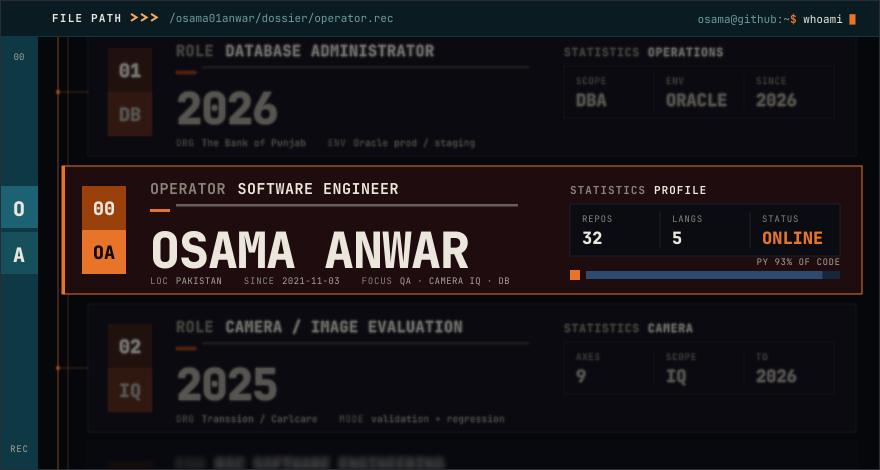</picture>

<a href="https://github.com/Osama01Anwar"><code>GITHUB</code></a>&nbsp;·&nbsp;
<a href="https://linkedin.com/in/osama-anwar-4b6a14199/"><code>LINKEDIN</code></a>&nbsp;·&nbsp;
<a href="mailto:theosamaanwar@gmail.com"><code>EMAIL</code></a>&nbsp;·&nbsp;
<a href="https://theosamaanwar.myportfolio.com"><code>PORTFOLIO</code></a>&nbsp;·&nbsp;
<a href="https://behance.net/theosamaanwar"><code>BEHANCE</code></a>&nbsp;·&nbsp;
<a href="https://instagram.com/https.osama/"><code>INSTAGRAM</code></a>

## <picture><source media="(max-width: 600px)" srcset="assets/mobile/sec-01.svg">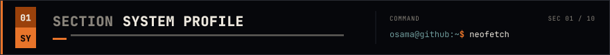</picture>

<picture><source media="(max-width: 600px)" srcset="assets/mobile/system.svg">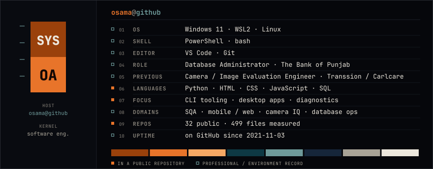</picture>

## <picture><source media="(max-width: 600px)" srcset="assets/mobile/sec-02.svg">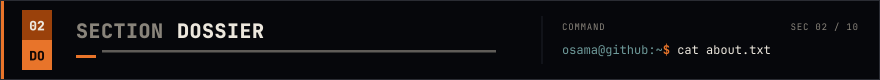</picture>

I build tools that talk to real hardware, measure something precisely, and refuse to guess
when they cannot. `camera-count-tool` is the clearest example: it reports a camera's shutter
count only when it can read it from a documented source, and returns `EXACT COUNT UNAVAILABLE`
rather than estimating one.

That habit comes from quality work. I validated camera image quality on physical devices —
exposure, colour, dynamic range, noise — and drove defects to closure with R&D, QA and vendor
teams. Today I administer Oracle production and staging databases.

Most of what I publish is Python: desktop and CLI tools, network diagnostics, and imaging
utilities. Photography is where the interest started.

## <picture><source media="(max-width: 600px)" srcset="assets/mobile/sec-03.svg">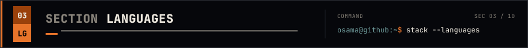</picture>

<picture><source media="(max-width: 600px)" srcset="assets/mobile/languages.svg">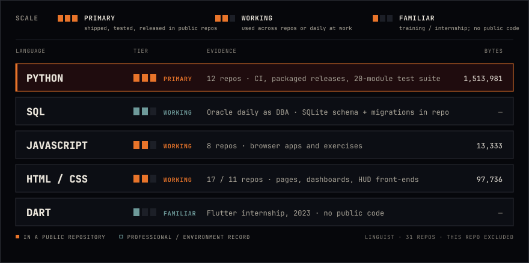</picture>

## <picture><source media="(max-width: 600px)" srcset="assets/mobile/sec-04.svg">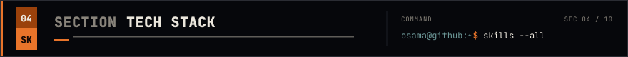</picture>

<picture><source media="(max-width: 600px)" srcset="assets/mobile/stack.svg"></picture>

## <picture><source media="(max-width: 600px)" srcset="assets/mobile/sec-05.svg">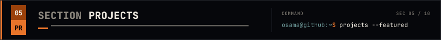</picture>

<a href="https://github.com/Osama01Anwar/camera-count-tool"><picture><source media="(max-width: 600px)" srcset="assets/mobile/project-camera-count-tool.svg">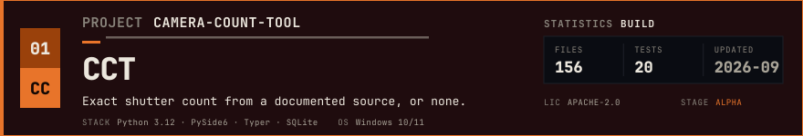</picture></a>
<a href="https://github.com/Osama01Anwar/Network-Analyzer"><picture><source media="(max-width: 600px)" srcset="assets/mobile/project-network-analyzer.svg">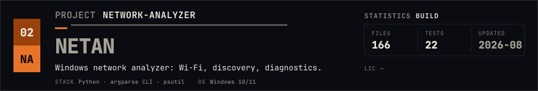</picture></a>
<a href="https://github.com/Osama01Anwar/ascii-Art"><picture><source media="(max-width: 600px)" srcset="assets/mobile/project-ascii-art.svg">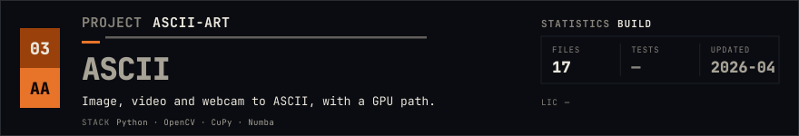</picture></a>
<a href="https://github.com/Osama01Anwar/HackingMonitor"><picture><source media="(max-width: 600px)" srcset="assets/mobile/project-hackingmonitor.svg">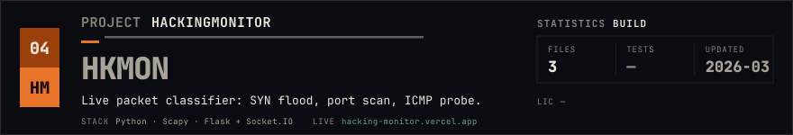</picture></a>
<a href="https://github.com/Osama01Anwar/The-Media-Enhancer"><picture><source media="(max-width: 600px)" srcset="assets/mobile/project-the-media-enhancer.svg">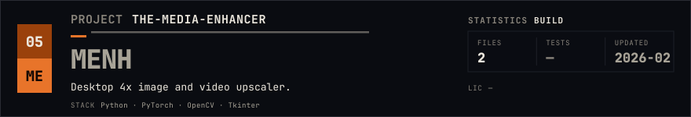</picture></a>
<a href="https://github.com/Osama01Anwar/3D_AppImage"><picture><source media="(max-width: 600px)" srcset="assets/mobile/project-3d_appimage.svg">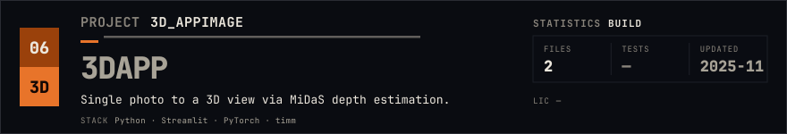</picture></a>

## <picture><source media="(max-width: 600px)" srcset="assets/mobile/sec-06.svg">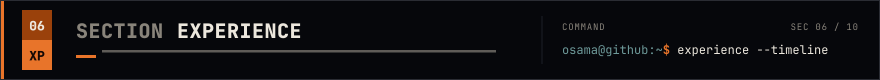</picture>

<picture><source media="(max-width: 600px)" srcset="assets/mobile/experience.svg">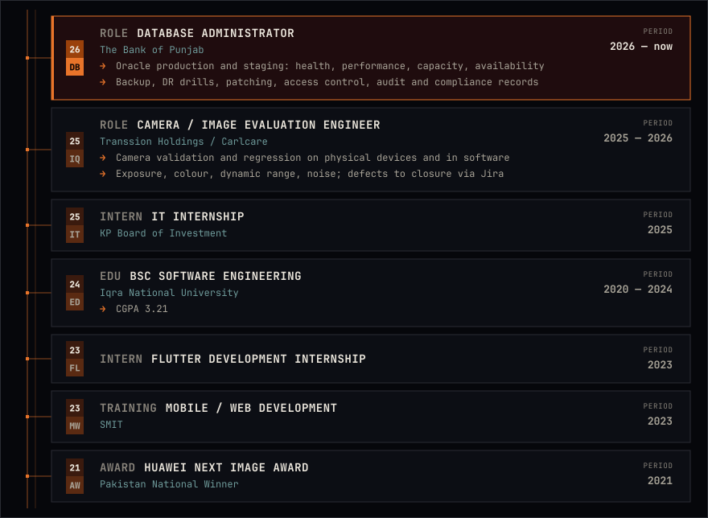</picture>

## <picture><source media="(max-width: 600px)" srcset="assets/mobile/sec-07.svg">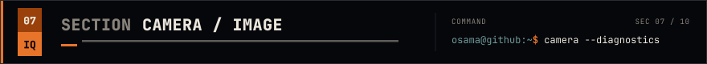</picture>

<picture><source media="(max-width: 600px)" srcset="assets/mobile/camera.svg">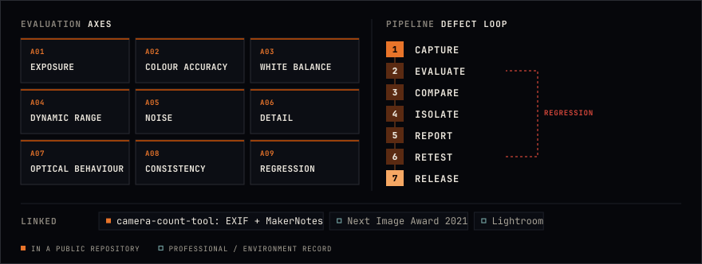</picture>

## <picture><source media="(max-width: 600px)" srcset="assets/mobile/sec-08.svg"></picture>

<picture><source media="(max-width: 600px)" srcset="assets/mobile/toolchain.svg">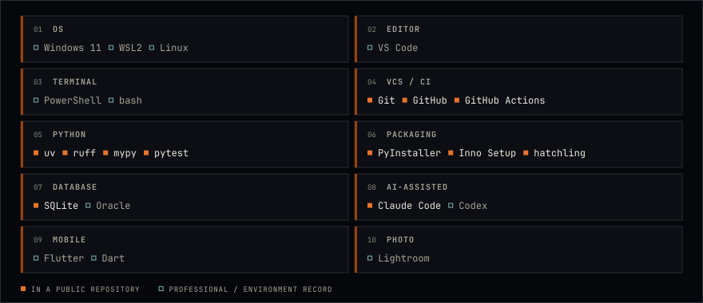</picture>

## <picture><source media="(max-width: 600px)" srcset="assets/mobile/sec-09.svg">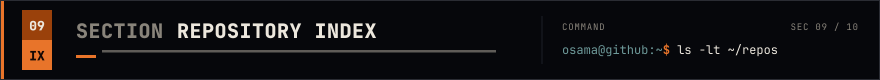</picture>

<picture><source media="(max-width: 600px)" srcset="assets/mobile/index.svg"></picture>

## <picture><source media="(max-width: 600px)" srcset="assets/mobile/sec-10.svg">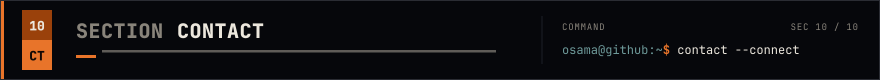</picture>

<a href="https://github.com/Osama01Anwar"><picture><source media="(max-width: 600px)" srcset="assets/mobile/contact-github.svg">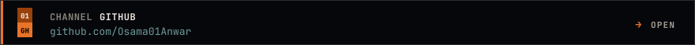</picture></a>
<a href="https://linkedin.com/in/osama-anwar-4b6a14199/"><picture><source media="(max-width: 600px)" srcset="assets/mobile/contact-linkedin.svg">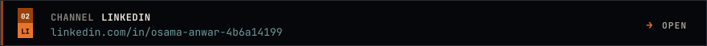</picture></a>
<a href="mailto:theosamaanwar@gmail.com"><picture><source media="(max-width: 600px)" srcset="assets/mobile/contact-email.svg">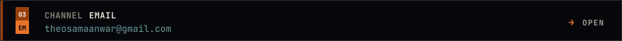</picture></a>
<a href="https://theosamaanwar.myportfolio.com"><picture><source media="(max-width: 600px)" srcset="assets/mobile/contact-portfolio.svg">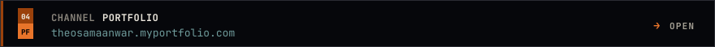</picture></a>
<a href="https://behance.net/theosamaanwar"><picture><source media="(max-width: 600px)" srcset="assets/mobile/contact-behance.svg">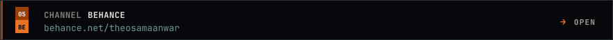</picture></a>
<a href="https://instagram.com/https.osama/"><picture><source media="(max-width: 600px)" srcset="assets/mobile/contact-instagram.svg">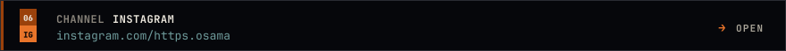</picture></a>

<picture><source media="(max-width: 600px)" srcset="assets/mobile/footer.svg">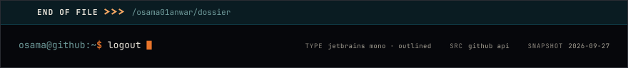</picture>
