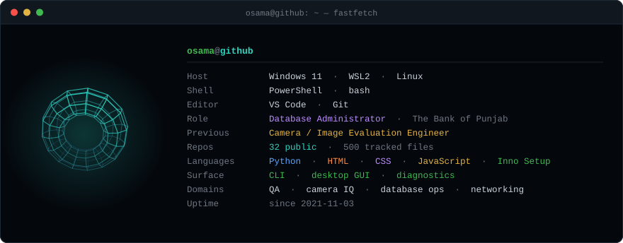
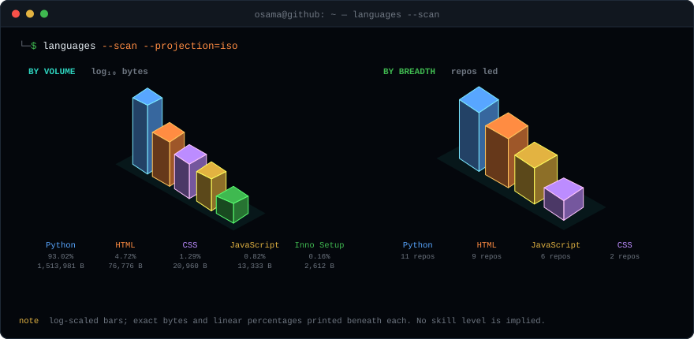
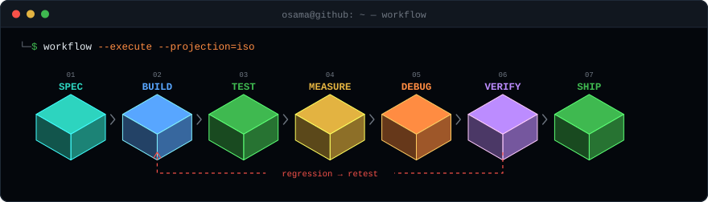

<div align="center">

<picture>
  <source media="(prefers-color-scheme: dark)" srcset="assets/header-dark.svg">
  <source media="(prefers-color-scheme: light)" srcset="assets/header-light.svg">
  
</picture>

</div>

## `$ whoami`

```console
$ whoami --verbose
Osama Anwar
```

Software engineer working across **desktop and CLI tooling, quality engineering,
camera and image-quality evaluation, database operations, and system diagnostics.**

Most of what I publish is Python: tools that talk to real hardware, measure something
precisely, and refuse to guess when they cannot. `camera-count-tool` is the clearest
statement of that — it reports a camera's shutter count only when it can read that
number from a documented source, and returns `EXACT COUNT UNAVAILABLE` rather than
estimating one. The same instinct runs through the rest of the work: measure, cite the
source, and report the negative result honestly.

Day to day I administer Oracle databases. Before that I evaluated camera image quality
against physical devices for a phone manufacturer. Both are on this page, but neither
is the whole picture.

## `$ neofetch`

<picture>
  <source media="(prefers-color-scheme: dark)" srcset="assets/fastfetch-dark.svg">
  <source media="(prefers-color-scheme: light)" srcset="assets/fastfetch-light.svg">
  
</picture>

## `$ experience --timeline`

```console
$ experience --timeline

2026 ──●  Database Administrator · The Bank of Punjab
       │  Oracle production and staging · health, performance, capacity and
       │  availability monitoring · backup operations · disaster-recovery drills
       │  patching and upgrades · users, roles, privileges and access control
       │  audit and compliance documentation · incident investigation and sign-off
       │
2025 ──●  Camera / Image Evaluation Engineer · Transsion Holdings / Carlcare
       │  camera validation and regression on physical devices and in software
       │  image-quality evaluation · exposure, colour, dynamic range, noise
       │  defect identification, tracking in Jira, and closure with R&D,
       │  QA and vendor teams · release-cycle validation
       │
2025 ──●  IT Internship · KP Board of Investment
       │
2023 ──●  Flutter Development Internship
       │  Mobile / Web Development Training · SMIT
       │
2020 ──●  BSc Software Engineering · Iqra National University   (2024, CGPA 3.21)
```

## `$ stack --inspect`

> **Evidence key** — ● present in this GitHub account, with the repository named.
> ○ professional or training experience that is **not** represented in these
> repositories. Nothing here is a self-assessed skill level.

```console
$ stack --inspect --show-evidence

LANGUAGES
├── Python ................. ●  12 repos · 1,513,981 B
├── HTML ................... ●  17 repos ·    76,776 B
├── CSS .................... ●  11 repos ·    20,960 B
├── JavaScript ............. ●   8 repos ·    13,333 B
├── SQL .................... ●  SQLite schema  ·  ○ Oracle SQL at work
└── Dart ................... ○  Flutter internship 2023 · no public repo

INTERFACES & FRAMEWORKS
├── PySide6 / Qt ........... ●  camera-count-tool desktop GUI
├── Typer .................. ●  camera-count-tool CLI
├── Tkinter ................ ●  4 repos
├── PyQt5 .................. ●  Internet-Speed-Test
├── Flask + Socket.IO ...... ●  HackingMonitor
├── Streamlit .............. ●  3D_AppImage
└── Flutter ................ ○  internship and training · no public repo

IMAGING · SIGNAL · ML
├── OpenCV ................. ●  3 repos
├── NumPy .................. ●  5 repos
├── Pillow ................. ●  2 repos
├── PyTorch ................ ●  The-Media-Enhancer · 3D_AppImage
├── torchvision · timm ..... ●  3D_AppImage
├── transformers ........... ●  spam_detetction
├── scikit-learn · NLTK .... ●  SpamTextClassifier
└── CuPy · Numba ........... ●  ascii-Art GPU path

SYSTEMS & PROTOCOLS
├── Windows WPD / COM ...... ●  camera-count-tool device access
├── PTP / MTP .............. ●  camera-count-tool
├── libusb · pyusb ......... ●  camera-count-tool optional backend
├── ExifTool · MakerNotes .. ●  camera-count-tool
├── Scapy .................. ●  HackingMonitor packet classification
├── psutil · py-cpuinfo .... ●  SpecTest · Network-Analyzer
└── Linux · WSL2 ........... ○  daily working environment

DATA
├── SQLite ................. ●  camera-count-tool local result store
└── Oracle Database ........ ○  production and staging administration

QUALITY · BUILD · RELEASE
├── pytest · pytest-qt ..... ●  camera-count-tool · Network-Analyzer
├── hypothesis ............. ●  camera-count-tool property and fuzz tests
├── ruff · mypy (strict) ... ●  camera-count-tool
├── GitHub Actions ......... ●  CI and release workflows
├── PyInstaller · Inno Setup ●  Windows installer and portable build
├── uv · hatchling ......... ●  environment and build backend
└── Jira ................... ○  defect tracking and release validation
```

## `$ languages --scan`

<picture>
  <source media="(prefers-color-scheme: dark)" srcset="assets/languages-dark.svg">
  <source media="(prefers-color-scheme: light)" srcset="assets/languages-light.svg">
  
</picture>

**Method.** Both charts are generated from the GitHub REST API — `/repos/{owner}/{repo}/languages`
summed over every public repository in this account, snapshot `2026-09-27`. *Volume* is raw
bytes as classified by GitHub Linguist. *Breadth* counts the repositories in which a language
is the largest, because volume is dominated by two large projects and would otherwise hide
everything else. Neither chart is a proficiency score, and no number on this page is hand-written
— see [`assets/build_assets.py`](assets/build_assets.py).

## `$ projects --list`

```console
$ projects --list --sort=weight

[01] camera-count-tool                                    Python · Apache-2.0
     ├─ Exact camera shutter/actuation count, or an explicit "unavailable"
     ├─ 156 files · 11 manufacturer adapters · CLI + Qt GUI · CI + installer
     └─ github.com/Osama01Anwar/camera-count-tool

[02] Network-Analyzer                                                 Python
     ├─ Windows 10/11 network analyzer: Wi-Fi, device discovery, diagnostics,
     │  bandwidth, packet capture, speed test, reporting, health monitoring
     ├─ 166 files · layered core/ui/utils · 22 test modules · CLI + menu
     └─ github.com/Osama01Anwar/Network-Analyzer

[03] HackingMonitor                                     Python · Flask · HTML
     ├─ Live network attack monitor — classifies SYN floods, port scans and
     │  ICMP probes from captured packets and streams them to a dashboard
     ├─ Scapy sniffer · Flask + Socket.IO · threshold-based classification
     └─ github.com/Osama01Anwar/HackingMonitor

[04] ascii-Art                                                        Python
     ├─ Image, video and webcam to ASCII with an optional GPU path
     ├─ CuPy + Numba acceleration · OpenCV capture · modular renderer
     └─ github.com/Osama01Anwar/ascii-Art

[05] The-Media-Enhancer                                               Python
     ├─ Desktop 4x image and video upscaler
     ├─ PyTorch model · OpenCV pipeline · Tkinter GUI
     └─ github.com/Osama01Anwar/The-Media-Enhancer

[06] 3D_AppImage                                                      Python
     ├─ Turns a single photo into a 3D view via MiDaS depth estimation,
     │  with an edge/distance-transform fallback when the model is absent
     ├─ Streamlit · PyTorch (torch.hub) · timm · torchvision · OpenCV
     └─ github.com/Osama01Anwar/3D_AppImage

[07] CodeCheck---python                                               Python
     ├─ Desktop code-quality analyzer: scores a project, grades it, explains
     │  the result and suggests improvements across 16 file types
     └─ github.com/Osama01Anwar/CodeCheck---python

[08] SpecTest                                                         Python
     ├─ Hardware specification and benchmark utility
     ├─ psutil · py-cpuinfo · multiprocessing load · Tkinter GUI
     └─ github.com/Osama01Anwar/SpecTest

     Also published: SpamTextClassifier and spam_detetction (scikit-learn,
     NLTK, transformers), Internet-Speed-Test (PyQt5), flight-weather-tracker,
     and a set of early web exercises from 2023-2024.
```

## `$ project inspect camera-count-tool`

```console
$ project inspect camera-count-tool

NAME         camera-count-tool
TYPE         Camera / developer utility
LANGUAGE     Python 3.12          LICENCE   Apache-2.0
INTERFACE    CLI + desktop GUI    PLATFORM  Windows 10/11 x64
PURPOSE      Read an exact shutter count, or state that it is unavailable

DESIGN CONSTRAINTS
[+] Offline      no network path anywhere in the program
[+] Read-only    every protocol operation checked against an allow-list
[+] No drivers   talks through Windows Portable Devices; installs nothing
[+] Cited        each number traces to a documented property or MakerNotes field
[-] No estimate  no statistics, no ML, no confidence scores, no derived counts

ARCHITECTURE
├── core/        models, enums, errors, source classification
├── ptp/         PTP transport, containers, parsers, session
├── wpd/         Windows Portable Devices COM session
├── usb/         enumeration, WPD backend, optional libusb backend
├── adapters/    11 manufacturer adapters + generic PTP fallback
├── registry/    11 camera YAML databases, JSON-schema validated
├── metadata/    ExifTool runner, field discovery, originality checks
├── report/      HTML, JSON and PDF report builders
├── db/          SQLite store with versioned migrations
├── cli/         typer command surface
└── gui/         PySide6 window, workers, theme

VERIFICATION
[+] 20 test modules - property tests, PTP fuzzing, plus no-network and
    forbidden-terminology guards that fail the build if hedging words appear
[+] ruff + mypy strict on core, ptp, adapters, registry, metadata
[+] GitHub Actions CI on windows-latest, release workflow, SHA256SUMS

INTERFACE
$ camera-count detect | inspect | count | exif FILE | report | supported
  exit 0  exact count found
  exit 2  no exact count available  (a correct result, not an error)
  exit 1  failure

REPOSITORY   https://github.com/Osama01Anwar/camera-count-tool
```

## `$ qa --profile`

> ○ Professional experience at Transsion Holdings / Carlcare. It is not
> represented in this account's repositories - the test engineering below it is.

```console
$ qa --profile

TESTING PRACTICE                        ○ professional
├── Functional and regression testing
├── Mobile application testing
├── Web application testing
├── Physical-device and software/virtual testing
├── Release-cycle validation
├── Defect identification, reproduction and tracking
└── Cross-team defect closure with R&D, QA and vendor teams

TEST ENGINEERING IN THIS ACCOUNT        ● evidenced
├── pytest suites ............. camera-count-tool (20), Network-Analyzer (22)
├── property-based testing .... hypothesis
├── protocol fuzzing .......... tests/ptp/test_fuzz.py
├── GUI testing ............... pytest-qt, offscreen Qt in CI
├── contract guards ........... no-network, forbidden-terms, release-hygiene
└── static analysis ........... ruff, mypy strict, enforced in CI

TOOLS
├── Jira ...................... ○ defect tracking and workflow
└── Git, GitHub Actions ....... ● version control and CI
```

## `$ camera --diagnostics`

```console
$ camera --diagnostics

DOMAIN     Camera and image-quality engineering
CONTEXT    ○ Transsion Holdings / Carlcare, 2025-2026
CODE       ● camera-count-tool - the engineering side of the same domain

EVALUATION AXES                    PIPELINE
├── Exposure                       Capture
├── Colour accuracy                   |
├── White balance                  Evaluate
├── Dynamic range                     |
├── Image noise                    Compare against reference
├── Detail preservation               |
├── Optical behaviour              Identify and isolate defect
├── Image consistency                 |
└── Regression across builds       Report and track
                                       |
                                   Retest
                                       |
                                   Release validation

WHERE IT MEETS THE CODE
Evaluating cameras means trusting the numbers a device reports about itself.
camera-count-tool is the rule I took from that work, written down: read the
value from a documented source and cite it, or report it as unavailable.
```

## `$ db --status`

```console
$ db --status

PRIMARY    Oracle Database - production and staging          ○ professional
SCOPE      The Bank of Punjab, 2026-present

OPERATIONS
├── Health, performance, capacity and availability monitoring
├── Backup operations and restore verification
├── Disaster-recovery drills
├── Patching and upgrades
├── Users, roles, privileges and access control
├── Audit and compliance documentation
└── Incident investigation, verification and operational sign-off

IN THIS ACCOUNT                                              ● evidenced
└── SQLite - schema, versioned migrations and a repository layer
    in camera-count-tool (src/camera_count/db/)
```

## `$ security --environment`

```console
$ security --environment

Interest and working environment. Not a professional security role,
and nothing here claims otherwise.

ENVIRONMENT                             ○ personal setup
├── Linux, WSL2, Windows
├── Shell tooling and system diagnostics
└── Security-oriented experimentation

WRITTEN AND PUBLISHED                   ● evidenced
├── HackingMonitor ..... live packet classification - SYN flood, port scan
│                        and ICMP probe detection over Scapy, streamed to
│                        a Flask + Socket.IO dashboard
├── Network-Analyzer ... ARP, packet capture, device discovery, firewall
│                        status, process-to-connection mapping, diagnostics
└── camera-count-tool .. read-only protocol allow-list, and an offline
                         guarantee enforced by a test that fails the build
                         on any network import
```

## `$ tools --inventory`

```console
$ tools --inventory

DEVELOPMENT   VS Code, Git, GitHub, Python 3.12, uv, pip, hatchling
SYSTEMS       Windows 11, WSL2, Linux, PowerShell, bash
DATA          Oracle ○, SQLite ●, SQL
QUALITY       pytest, pytest-qt, hypothesis, ruff, mypy, Jira ○
BUILD         GitHub Actions, PyInstaller, Inno Setup
IMAGING       OpenCV, Pillow, NumPy, ExifTool, Lightroom ○
AI-ASSISTED   Claude Code, Codex - used on camera-count-tool, which carries
              a CLAUDE.md describing how that work is constrained
```

## `$ image --profile`

```console
$ image --profile

PHOTOGRAPHY                             ○ practice
├── Digital photography
├── Image editing and Lightroom
└── Huawei Next Image Award - Pakistan National Winner, 2021

WHERE IT BECOMES ENGINEERING            ● evidenced
├── camera-count-tool .. EXIF and MakerNotes parsing, originality checks
├── The-Media-Enhancer .. 4x image and video upscaling, PyTorch + OpenCV
├── 3D_AppImage ........ MiDaS monocular depth estimation to a 3D view
└── ascii-Art .......... image, video and webcam conversion with a GPU path

Photography is where the interest started; the camera work and the imaging
repositories are what it turned into.
```

## `$ workflow --execute`

<picture>
  <source media="(prefers-color-scheme: dark)" srcset="assets/pipeline-dark.svg">
  <source media="(prefers-color-scheme: light)" srcset="assets/pipeline-light.svg">
  
</picture>

## `$ credentials --list`

```console
$ credentials --list

EDUCATION
└── BSc Software Engineering, Iqra National University, 2020-2024, CGPA 3.21

AWARD
└── Huawei Next Image Award - Pakistan National Winner, 2021
```

## `$ contact --connect`

[**GitHub**](https://github.com/Osama01Anwar) ·
[**LinkedIn**](https://linkedin.com/in/osama-anwar-4b6a14199/) ·
[**Email**](mailto:theosamaanwar@gmail.com) ·
[**Portfolio**](https://theosamaanwar.myportfolio.com) ·
[**Behance**](https://behance.net/theosamaanwar) ·
[**Instagram**](https://instagram.com/https.osama/)

<div align="center">

<sub>
Every repository count, byte count, file count and test count on this page was read from the
GitHub REST API on <b>2026-09-27</b> and rendered by
<a href="assets/build_assets.py"><code>assets/build_assets.py</code></a>.
Run <code>python assets/build_assets.py --fetch</code> to re-query GitHub and regenerate.
No third-party statistics services, no scripts, no tracking.
</sub>

</div>
